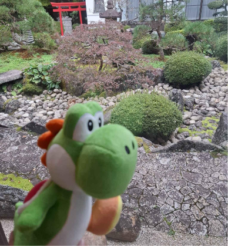
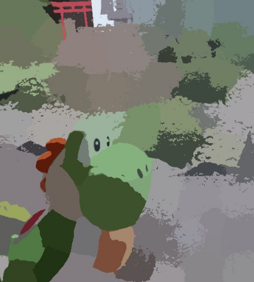
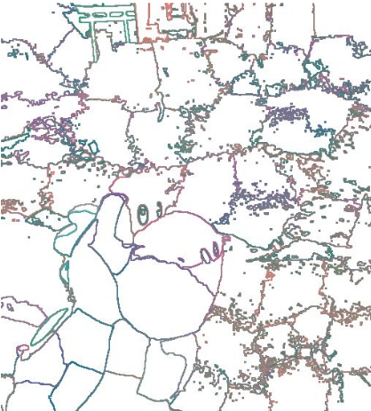
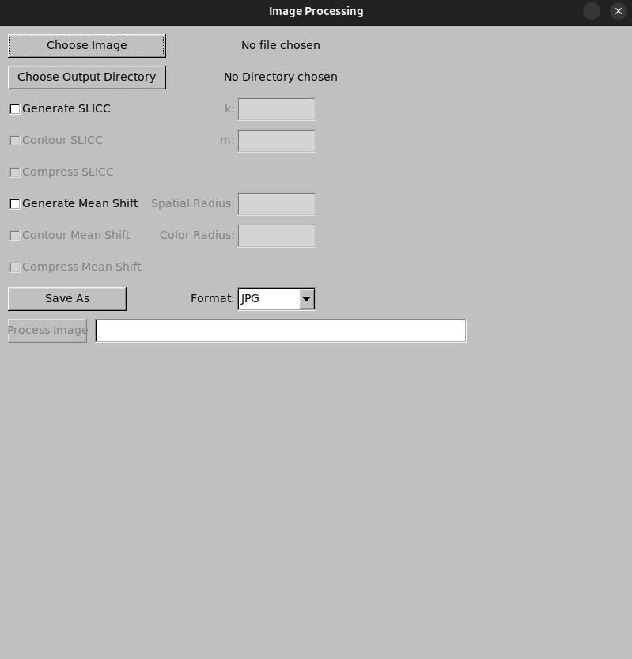

[EN]

# SuperPixels Image Processing Application

## Overview
This project is a **C++ Image Processing Application** to tranform images into superpixelized images using **SLICC** and **Mean Shift** algorithms. The main goal of this project is to provide a user-friendly interface for advanced image processing techniques, making it accessible to users without extensive programming knowledge.
---

## Screenshots

  

## Features
- **Image Selection**: Choose an image file (PPM, JPG, PNG) for processing.
- **Output Directory Selection**: Specify the directory where processed images will be saved.
- **SLICC Superpixel Segmentation**:
    - Generate superpixels using SLICC.
    - Optionally generate contour and compressed versions of the segmented image.
- **Mean Shift Clustering**:
    - Perform Mean Shift segmentation with adjustable spatial and color radii.
    - Optionally generate contour and compressed versions of the segmented image.
- **Image Format Conversion**: Save processed images in JPG, PNG, or PPM formats.
- **Image Preview**: View the original or processed images in a resizable preview window.
- **Progress Tracking**: Visual progress bar for image processing tasks.

---

## Prerequisites
### Dependencies
- **FLTK Library**: GUI framework for building the application.
- **ImageMagick**: For image format conversion (e.g., PPM to JPG/PNG).
- **C++ Compiler**: Compatible with C++17 or later.

### Installation
1. Install the required libraries:
    - On Ubuntu:
      ```bash
      sudo apt-get install libfltk1.3-dev imagemagick
      ```
    - On macOS (using Homebrew):
      ```bash
      brew install fltk imagemagick
      ```
2. Clone the repository:
   ```bash
   git clone <repository-url>
   cd <repository-folder>
   
3. Build the application:
   ```bash
   mkdir build
   cd build
   cmake ..
   make
   ```
---
## Use the application
   - Choose an Image: Click the "Choose Image" button to select an image file.
   - Set Output Directory: Click the "Choose Output Directory" button to specify where processed images will be saved.
   - Select Processing Options:
   - Enable SLICC or Mean Shift processing.
   - Adjust parameters (e.g., k, m, spatial radius, color radius).
   - Enable optional features like contour generation or compression.
   - Save Format: Choose the desired output format (JPG, PNG, or PPM).
   - Process Image: Click the "Process Image" button to start processing.
   - Preview Image: Use the "Preview Image" button to view the original or processed image. 
   

### File Format Support:
- Input: PPM, JPG, PNG
- Output: JPG, PNG, PPM

---

## File Structure:
```plaintext
   ├── Code/
   │   ├── main.cpp                # Main application logic
   │   ├── FonctionsImages.cpp     # Image processing functions
   │   ├── Image.h                 # Image class header
   │   ├── Image.cpp               # Image class implementation
   ├── CR/                         # French Documentation about the work
   ├── CMAKELists.txt              # Build configuration
   ├── Image/                      # Image files for testing
   └── README.md                   # Project documentation
```
---
[FR]

# Application de Traitement d'Images SuperPixels

## Vue d'ensemble
Ce projet est une **application de traitement d'images en C++** permettant de transformer des images en superpixels à l'aide des algorithmes **SLICC** et **Mean Shift**. L'objectif principal de ce projet est de fournir une interface conviviale pour des techniques avancées de traitement d'images, la rendant accessible aux utilisateurs sans connaissances approfondies en programmation.

---

## Fonctionnalités
- **Sélection d'image** : Choisissez un fichier image (PPM, JPG, PNG) à traiter.
- **Sélection du répertoire de sortie** : Spécifiez le répertoire où les images traitées seront enregistrées.
- **Segmentation en superpixels SLICC** :
    - Générez des superpixels à l'aide de SLICC.
    - Générez éventuellement des versions avec contours et compressées de l'image segmentée.
- **Clustering Mean Shift** :
    - Effectuez une segmentation Mean Shift avec des rayons spatial et colorimétrique ajustables.
    - Générez éventuellement des versions avec contours et compressées de l'image segmentée.
- **Conversion de format d'image** : Enregistrez les images traitées aux formats JPG, PNG ou PPM.
- **Aperçu de l'image** : Visualisez les images originales ou traitées dans une fenêtre d'aperçu redimensionnable.
- **Suivi de progression** : Barre de progression visuelle pour les tâches de traitement d'images.

---

## Prérequis
### Dépendances
- **Bibliothèque FLTK** : Framework GUI pour construire l'application.
- **ImageMagick** : Pour la conversion de formats d'image (par exemple, PPM en JPG/PNG).
- **Compilateur C++** : Compatible avec C++17 ou une version ultérieure.

### Installation
1. Installez les bibliothèques requises :
    - Sur Ubuntu :
      ```bash
      sudo apt-get install libfltk1.3-dev imagemagick
      ```
    - Sur macOS (avec Homebrew) :
      ```bash
      brew install fltk imagemagick
      ```
2. Clonez le dépôt :
   ```bash
   git clone <repository-url>
   cd <repository-folder>
   
3. Construisez l'application :
   ```bash
   mkdir build
   cd build
   cmake ..
   make
   ```
---
## Utilisation de l'application
   - Choisissez une image : Cliquez sur le bouton "Choose Image" pour sélectionner un fichier image.
   - Définissez le répertoire de sortie : Cliquez sur le bouton "Choose Output Directory" pour spécifier où les images traitées seront enregistrées.
   - Sélectionnez les options de traitement :
   - Activez le traitement SLICC ou Mean Shift.
   - Ajustez les paramètres (par exemple, k, m, rayon spatial, rayon colorimétrique).
   - Activez des fonctionnalités optionnelles comme la génération de contours ou la compression.
   - Format d'enregistrement : Choisissez le format de sortie souhaité (JPG, PNG ou PPM).
   - Traitez l'image : Cliquez sur le bouton "Process Image" pour démarrer le traitement.
   - Aperçu de l'image : Utilisez le bouton "Preview Image" pour visualiser l'image originale ou traitée. 
   

### Formats de fichiers pris en charge :
- Entrée : PPM, JPG, PNG
- Sortie : JPG, PNG, PPM

---

## Structure des fichiers :
```plaintext
   ├── Code/
   │   ├── main.cpp                # Logique principale de l'application
   │   ├── FonctionsImages.cpp     # Fonctions de traitement d'images
   │   ├── Image.h                 # En-tête de la classe Image
   │   ├── Image.cpp               # Implémentation de la classe Image
   ├── CR/                         # Documentation en français sur le travail
   ├── CMAKELists.txt              # Configuration de la construction
   ├── Image/                      # Fichiers d'image pour les tests
   └── README.md                   # Documentation du projet
